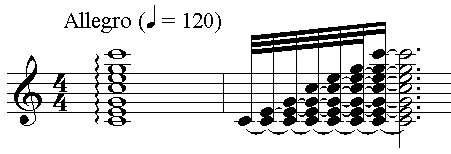

# 音符

## 乐音（Musical Sound）

> Musical sound, any tone with characteristics such as controlled pitch and timbre. The sounds are produced by instruments in which the periodic vibrations can be controlled by the performer.
> -- <cite>[Britannica](https://www.britannica.com/science/musical-sound)</cite>

- 理解
  - 乐音是音乐的最基本单位
  - 任何一个声音都可以是一个乐音，只要它具有一定的特征。比如钢琴上按一个键发出的声音，是一个好听的乐音；救护车发出的一声刺耳的鸣笛，是一个不那么好听的乐音

## 音符（Musical Note）

> In music, a note is the representation of a musical sound. Notes can represent the pitch and duration of a sound in musical notation. A note can also represent a pitch class.
> -- <cite>[Wikipedia](https://en.wikipedia.org/wiki/Musical_note)</cite>

> A musical note consists of four things: a loudness, a duration, a timbre and a pitch.
> -- <cite>John Powell, How Music Works</cite>

- 理解
  - 音符是乐音的表现形式，由音高，音色，音长和音量四部分组成
  - 在记谱法（Musical Notation）上，音符可以表现音高和音长
  - 音符如何去表现音色和音量？这个还没有想明白
- 实例
  
  - 上图左边是五线谱的谱号（Clef），右边是八分音符 A
  - 从音符的形状（实心符头和一条符尾），我们可以知道这是一个八分音符
  - 从音符的位置（符头在从下往上的第二线和第三线之间），我们可以知道这是音符 A

### 1. 音高(Pitch)

> Pitch is a perceptual property of sounds that allows their ordering on a frequency-related scale, or more commonly, pitch is the quality that makes it possible to judge sounds as "higher" and "lower" in the sense associated with musical melodies. Pitch is a major auditory attribute of musical tones, along with duration, loudness, and timbre.
> -- <cite>[Wikipedia](<https://en.wikipedia.org/wiki/Pitch_(music)>)</cite>

- 理解
  - 基本可以简化理解为频率；Wikipedia 强调了音高是主观的不可度量的感受，而频率是客观的可度量的属性

#### 音名（Pitch Names）

> 音名就是音高的名称，即 C、D、E、F、G、A、B。音名和音高的关系是绝对的；与音名相对的唱名则不同，唱名和音高的关系一般是相对的。每高或低八度音高的音名是一样；而唱名就算是不同的音高，也可以一样。
> -- <cite>[Wikipedia](https://zh.wikipedia.org/wiki/%E9%9F%B3%E5%90%8D)</cite>

- 理解
  - 没有找到*音名*的明确的英文定义
  - 我们常用的 C、D、E、F、G、A、B，中文叫音名似乎没有问题，英文可以是 Pitch Name（音高的名称），也可以是 Note Name（音符的名称）

#### 唱名（Solfège）

> In music, solfège (/ˈsɒlfɛʒ/, French: [sɔlfɛʒ]) or solfeggio (/sɒlˈfɛdʒioʊ/; Italian: [solˈfeddʒo]), also called sol-fa, solfa, solfeo, among many names, is a music education method used to teach aural skills, pitch and sight-reading of Western music.
> -- <cite>[Wikipedia](https://en.wikipedia.org/wiki/Solf%C3%A8ge)</cite>

- 理解
  - 唱名只是用来教授音高和视唱的音乐教育方法。有助于演唱者区分音程，并加强对乐理的理解
  - 唱名是do、re、mi、fa、sol、la、ti
  - 唱名有首调唱名法与固定唱名法两种
    - 首调唱名法：将当前调的主音唱成do。
    - 固定唱名法：将do、re、mi、fa、sol、la、ti与C、D、E、F、G、A、B 一一对应。无论哪个调，唱名都是绝对的

### 2. 音色(Timbre)

> In music, timbre, also known as tone color or tone quality (from psychoacoustics), is the perceived sound quality of a musical note, sound or tone. Timbre distinguishes different types of sound production, such as choir voices and musical instruments.
> -- <cite>[Wikipedia](https://en.wikipedia.org/wiki/Timbre)</cite>

- 理解
  - 音色（亦可称为音质）是同一个音在不同乐器上的不同表现。同一个 C，在钢琴上和吉他上都是同样的频率，但是不同的音色使我们可以分辨出声音来自不同乐器

### 3. 音长(Duration)

> In music, duration is an amount of time or how long or short a note, phrase, section, or composition lasts.
> -- <cite>[Wikipedia](<https://en.wikipedia.org/wiki/Duration_(music)>)</cite>

- 理解
  - 常用音符：全音符（whole note），二分音符（half note），四分音符（quarter note），八分音符（eighth note），十六分音符（sixteenth note）
  - 注意这只是一个相对音长，只有标明了节拍器速度的乐谱，才知道绝对音长。下图 Allegro（快板）后面的括号里标明的节拍器速度为每分钟 120 个四分音符，也就是 240 个八分音符；所以一个八分音符的音长在此速度下为 60 秒/240=四分之一秒
    

### 4. 音量(Loudness)

> In acoustics, loudness is the subjective perception of sound pressure.
> -- <cite>[Wikipedia](https://en.wikipedia.org/wiki/Loudness)</cite>

- 理解
  - Wikipedia 又说这是个主观感受；但是实际上音量应该可以用分贝值来度量，只是在音乐中好像确实不太用分贝
