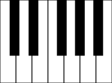
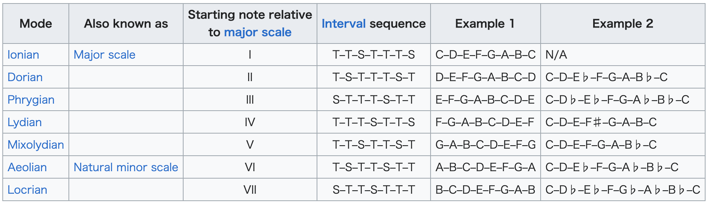

# 音阶（Scale）

> In music theory, a scale is any set of musical notes ordered by fundamental frequency or pitch. A scale ordered by increasing pitch is an ascending scale, and a scale ordered by decreasing pitch is a descending scale.
> -- <cite>[Wikipedia](<https://en.wikipedia.org/wiki/Scale_(music)>)</cite>

- 理解

  - 音阶是一组按照音高顺序排列的音符；升序为上行音阶，降序为下行音阶
  - 比较常用的音阶
    - 半音音阶（Chromatic Scale）是指有十二个不同音高顺序排列的音阶，每两个音之间差半个音
    - 七声音阶（Heptatonic Scale）指有七个不同音高顺序排列的音阶
      - 自然音阶（Diatonic Scale）是一种特殊的七声音阶。在一个八度内它总是包含五个全音和两个半音；并且两个半音之间总是相隔两个或者三个全音
        - 大调音阶（Major Scale）：音程结构为【全全半全全全半】的自然音阶
        - 小调音阶（Minor Scale）：音程结构为【全半全全半全全】的自然音阶
    - 其他还有九声音阶（Nonatonic），八声音阶（Octatonic），六声音阶（Hexatonic），五声音阶（Pentatonic）
    - 甚至有四声音阶，三声音阶，二声音阶；只存在于理论上，或者人类历史早期
    - 中国古代音乐主要采用五声音阶：宫，商，角，徵，羽

- 实例

  - 半音音阶（Chromatic Scale）：下图全部 12 个黑键白键一起组成一个八度内的半音音阶
    
  - 七声音阶（Heptatonic Scale）：上图中任意 7 个键即是一个七声音阶
  - 自然音阶（Diatonic Scale）：上图中 7 个白键即是一个自然音阶；或者钢琴上任何连续的 7 个白键都是一个自然音阶
  - 大调音阶（Major Scale）：上图中 7 个白键即是一个大调音阶；主音（Tonic）为 C，所以称为 C 大调
  - 小调音阶（Minor Scale）：上图中从第 6 个白键（A）开始，往右边连续 7 个白键，其音程结构符合【全半全全半全全】，即为 A 小调

## 音级（Degree）

> In music theory, the scale degree is the position of a particular note on a scale relative to the tonic, the first and main note of the scale from which each octave is assumed to begin. Degrees are useful for indicating the size of intervals and chords and whether an interval is major or minor.
>
> In a more specific sense, scale degrees are given names that indicate their particular function within the scale.
> -- <cite>[Wikipedia](<https://en.wikipedia.org/wiki/Degree_(music)>)</cite>

- 理解
  - 音阶上的任意音，相对于主音的位置，就叫做该音的音级；通常从 1 开始
  - 每个音级一般还有名称
    | Degree | Name | 中文名 |
    | ------ | ---- | ----- |
    | 1 | Tonic | 主音 |
    | 2 | Supertonic | 上主音 |
    | 3 | Mediant | 中音 |
    | 4 | Subdominant | 下属音 |
    | 5 | Dominant | 属音 |
    | 6 | Submediant | 下中音 |
    | 7 | Subtonic (in minor scale) or Leading tone (in major scale) | 下主音 或 导音 |
    | 1 | Tonic (octave) | 主音 |
  - 详细可参考[音级名称](<https://en.wikipedia.org/wiki/Degree_(music)#Scale_degree_names>)

## 调式（Mode）

> In music theory, the term mode or modus is used in a number of distinct senses, depending on context. Its most common use may be described as a type of musical scale coupled with a set of characteristic melodic and harmonic behaviors.
> -- <cite>[Wikipedia](<https://en.wikipedia.org/wiki/Mode_(music)>)</cite>

- 理解
  - 调式是音阶的类型（按照音与音之间的排列模式，以及与此关联的旋律，和声等特性来分类）
  - 全部的自然音阶可分为七种调式
    
  - 大调和小调是其中最常用的两种调式。参照[什麼是大調和小調？](https://www.youtube.com/watch?v=T70L-t60j5c)
